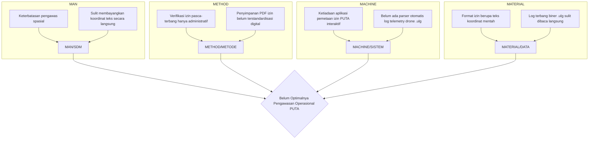

# LAPORAN REVERSE-ENGINEERING & DRAFT MATRIKS AKTUALISASI LATSAR CPNS
**Penerapan Aplikasi PUTA-Monitor Pada Kantor Otoritas Bandar Udara Kelas II Wilayah VI Padang**

---

## 1. PENDAHULUAN & KONTEKS ORGANISASI

Sebagai **Pengevaluasi Penerbangan** (Jabatan Pelaksana) di **Kantor Otoritas Bandar Udara Kelas II Wilayah VI Padang (OBU Wilayah VI)** yang memiliki yurisdiksi atas wilayah Sumatera Barat dan sekitarnya, keselamatan operasi penerbangan merupakan prioritas mutlak. 

Berdasarkan **Keputusan Menteri Perhubungan Nomor KM 143 Tahun 2024** tentang Peta Jabatan dan Uraian Jenis Kegiatan Jabatan di Lingkungan UPT DJPU, jabatan Pengevaluasi Penerbangan memiliki kewajiban melakukan inventarisasi, pemeriksaan, dan analisis data terkait pengoperasian bandar udara serta navigasi penerbangan.

Perkembangan teknologi **Pesawat Udara Tanpa Awak (PUTA) / Drone** di wilayah Sumatera Barat (baik untuk kebutuhan pemetaan lahan, konstruksi, maupun hobi) meningkat sangat pesat. Sesuai **PM 37 Tahun 2020** (Pengoperasian PUTA di Ruang Udara yang Dilayani Indonesia) dan **PM 63 Tahun 2021** (CASR Part 107), pengoperasian drone di sekitar kawasan bandar udara dan ruang udara terkontrol wajib memiliki persetujuan/izin khusus demi mencegah tabrakan dengan pesawat udara berawak di Kawasan Keselamatan Operasi Penerbangan (KKOP).

Namun, pengawasan perizinan PUTA di OBU Wilayah VI selama ini menghadapi tantangan besar karena belum tersedianya alat pemantauan yang terintegrasi secara visual dan spasial. Hal inilah yang mendasari rancangan aktualisasi ini.

---

## 2. IDENTIFIKASI DAN ANALISIS ISU AKTUAL (AGENDA 3)

Berdasarkan pengamatan pada Unit Kerja Otoritas Bandar Udara Kelas II Wilayah VI Padang, terdapat 3 (tiga) isu aktual yang menghambat efektivitas pelayanan dan keselamatan penerbangan, yang diidentifikasi berdasarkan tugas fungsi jabatan (UJK):

### Isu 1: Belum optimalnya pengawasan dan evaluasi kepatuhan operasional Pesawat Udara Tanpa Awak (PUTA) di wilayah kerja Kantor Otoritas Bandar Udara Kelas II Wilayah VI Padang.
*   **Korelasi UJK:** 
    *   **UJK 2:** Menginventarisasi, memeriksa, dan menganalisis bahan dan data terkait pengawasan dan pengendalian peralatan, fasilitas dan pengoperasian bandar udara dan navigasi penerbangan.
    *   **UJK 6:** Menginventarisasi, memeriksa, dan menganalisis bahan dan data terkait pelaksanaan Standar Operasional Prosedur (SOP) dan standar kinerja operasional fasilitas.
*   **Kondisi Saat Ini:** Evaluasi kepatuhan izin terbang PUTA masih bersifat administratif dan manual. Pengawas kesulitan memvisualisasikan batas-batas koordinat izin yang tertuang dalam dokumen PDF perizinan. Selain itu, tidak ada metode untuk memvalidasi apakah drone benar-benar terbang sesuai area koordinat dan batas ketinggian izin (cap 400 kaki/120 meter) setelah operasi selesai dilakukan.
*   **Dampak Jika Tidak Diselesaikan:** Meningkatnya risiko insiden penerbangan berupa *airspace intrusion* (penerbangan drone ilegal/menyimpang di area KKOP Bandara Minangkabau atau Depati Amir) yang dapat membahayakan keselamatan pesawat udara berawak.

### Isu 2: Belum terintegrasinya inventarisasi dan pendataan fasilitas pendukung navigasi penerbangan pada bandar udara di bawah yurisdiksi Otoritas Bandar Udara Kelas II Wilayah VI.
*   **Korelasi UJK:**
    *   **UJK 1:** Menginventarisasi, memeriksa, dan menganalisis bahan dan data terkait pengaturan fasilitas, peralatan dan pengoperasian bandar udara.
    *   **UJK 7:** Menginventarisasi, memeriksa, dan menganalisis bahan dan data terkait peralatan dan pelayanan bandar udara dan navigasi penerbangan.
*   **Kondisi Saat Ini:** Data mengenai ketersediaan, status kelaikan, dan kalibrasi alat navigasi penerbangan (seperti ILS, DVOR, DME) masih tercatat dalam lembar kerja (spreadsheet) lokal yang terpisah di masing-masing sub-bagian tanpa visualisasi spasial koordinat alat.
*   **Dampak Jika Tidak Diselesaikan:** Proses penarikan data fasilitas navigasi saat dibutuhkan untuk audit mendadak atau evaluasi keselamatan menjadi lambat dan berpotensi terjadi kesalahan pelaporan.

### Isu 3: Belum efektifnya monitoring masa berlaku sertifikat kompetensi dan lisensi personel bandar udara dan navigasi penerbangan di wilayah OBU Wilayah VI.
*   **Korelasi UJK:**
    *   **UJK 8:** Menginventarisasi, memeriksa, dan menganalisis bahan dan data terkait pengendalian sertifikat kompetensi dan lisensi personel bandar udara dan navigasi penerbangan.
*   **Kondisi Saat Ini:** Pemantauan lisensi personel bandara (seperti ATC, teknisi penerbangan, *Airport Security*) masih menggunakan pencatatan manual. Tidak ada sistem notifikasi otomatis yang mengingatkan pengawas maupun personel bersangkutan sebelum lisensi kedaluwarsa.
*   **Dampak Jika Tidak Diselesaikan:** Berpotensi adanya personel yang bertugas dengan lisensi yang sudah kedaluwarsa, yang menyalahi regulasi keselamatan penerbangan nasional dan internasional.

---

## 3. PENAPISAN ISU MENGGUNAKAN METODE USG (URGENCY, SERIOUSNESS, GROWTH)

Untuk menentukan isu prioritas (Core Issue) yang akan dicarikan gagasannya, dilakukan penapisan isu menggunakan metode **USG** dengan skala likert 1-5:

| No | Isu Aktual | Urgency (U) | Seriousness (S) | Growth (G) | Total Skor | Peringkat |
|:--:|:---|:---:|:---:|:---:|:---:|:---:|
| **1** | **Belum optimalnya pengawasan dan evaluasi kepatuhan operasional Pesawat Udara Tanpa Awak (PUTA) di wilayah kerja Kantor Otoritas Bandar Udara Kelas II Wilayah VI Padang.** | **5** | **5** | **5** | **15** | **I (Core Issue)** |
| 2 | Belum terintegrasinya inventarisasi dan pendataan fasilitas pendukung navigasi penerbangan pada bandar udara di bawah yurisdiksi OBU Kelas II Wilayah VI. | 4 | 4 | 3 | 11 | II |
| 3 | Belum efektifnya monitoring masa berlaku sertifikat kompetensi dan lisensi personel bandar udara dan navigasi penerbangan di wilayah OBU Wilayah VI. | 3 | 4 | 3 | 10 | III |

### Justifikasi Skoring USG untuk Isu 1 (Core Issue):
1.  **Urgency (5/5):** Peningkatan frekuensi penerbangan drone komersial di Sumatera Barat sangat tinggi (misal proyek PTSL BPN Kota Padang, pemetaan sawit, dan dokumentasi). Jika pengawasan spasial tidak segera diwujudkan, pengawas buta terhadap potensi bahaya di sekeliling bandara secara langsung.
2.  **Seriousness (5/5):** Pelanggaran ruang udara oleh drone dapat mengakibatkan kegagalan mesin pesawat akibat *ingestion* (drone tersedot ke mesin jet) atau tabrakan fisik (*mid-air collision*), yang berakibat fatal pada keselamatan ratusan nyawa penumpang.
3.  **Growth (5/5):** Tanpa adanya sistem visualisasi, jumlah perizinan PUTA yang menumpuk di file PDF akan terus bertambah tanpa bisa dilacak korelasinya satu sama lain secara geografis, menciptakan akumulasi risiko pelanggaran ruang udara yang semakin besar.

---

## 4. ANALISIS ROOT CAUSE (FISHBONE DIAGRAM FRAMEWORK)

Untuk merumuskan akar masalah dari Core Issue (Isu 1), digunakan analisis tulang ikan (*Fishbone*):



### Akar Masalah Utama (Root Cause):
Akar masalah utama terletak pada aspek **Machine (Sistem/Alat Bantu)** dan **Method (Metode)**: *Belum tersedianya sistem aplikasi visualisasi spasial perizinan PUTA serta parser log biner telemetry penerbangan drone (`.ulg`) yang terintegrasi di Kantor OBU Wilayah VI.*

---

## 5. GAGASAN KREATIF & ARSITEKTUR TEKNIS SOLUSI

Sebagai solusi atas akar masalah tersebut, dirumuskan gagasan kreatif aktualisasi:
**"Digitalisasi Pengawasan dan Visualisasi Izin Operasional PUTA (Pesawat Udara Tanpa Awak) Melalui Aplikasi Desktop 'PUTA-Monitor' Berbasis Electron JS dan Supabase Cloud Database di Kantor Otoritas Bandar Udara Kelas II Wilayah VI Padang."**

### Arsitektur Teknis Aplikasi PUTA-Monitor:
Aplikasi yang dirancang mandiri oleh peserta ini memiliki spesifikasi arsitektur sebagai berikut:

```
┌────────────────────────────────────────────────────────────────────────┐
│                        PUTA-Monitor Desktop App                        │
│                                                                        │
│  ┌───────────────────────┐  ┌────────────────────┐  ┌───────────────┐  │
│  │     FRONTEND UI       │  │    MAP ENGINE      │  │ SECURE STORE  │  │
│  │   HTML5, CSS, ES6     │  │     Leaflet.js     │  │ SafeStorage   │  │
│  └───────────┬───────────┘  └─────────┬──────────┘  └───────┬───────┘  │
└──────────────┼────────────────────────┼─────────────────────┼──────────┘
               │ IPC                    │                     │
               ▼                        ▼                     ▼
┌────────────────────────────────────────────────────────────────────────┐
│                          Electron Main Process                         │
│   (Local Caching: permits.json | Local Offline System Integration)     │
└──────────────┬──────────────────────────────────────────────┬──────────┘
               │                                              │
               ▼ IPC Execution                                ▼ REST API / HTTPS
┌──────────────────────────────────────┐        ┌────────────────────────┐
│         Python Data Engine           │        │   Supabase Cloud DB    │
│  - pyulog (Parses .ulg telemetry)    │        │  - PostgreSQL Permits  │
│  - KML & GPX Track Generator         │        │  - RLS Security / Auth │
│  - Coordinate standardizer           │        │  - PDF Cloud Storage   │
└──────────────────────────────────────┘        └────────────────────────┘
```

1.  **Desktop Runtime (Electron JS):** Memungkinkan aplikasi berjalan secara native di sistem operasi Windows milik kantor OBU VI, dapat membaca file secara lokal, serta mendukung enkripsi aman dengan `safeStorage` untuk token sesi pengguna.
2.  **Sistem Pemetaan Spasial (Leaflet.js):** Menggambar batas wilayah udara KKOP bandar udara (misal Minangkabau & Depati Amir) menggunakan data KML, serta secara otomatis memetakan koordinat poligon izin drone dari data perizinan.
3.  **Parser Log Telemetri Drone (Python + `pyulog`):** Mengonversi log penerbangan biner drone (`.ulg` dari autopilot PX4) ke format standard (CSV, KML, GPX). File hasil konversi diplot di atas peta Leaflet untuk membandingkan secara visual jalur terbang riil drone terhadap poligon batas izinnya (*post-flight compliance audit*).
4.  **Database & Cloud Sync (Supabase PostgreSQL):** Menyimpan database metadata izin drone secara online sehingga data terpusat, aman dengan skema RLS (*Row Level Security*), serta menyinkronkan file PDF izin asli ke Supabase Storage. Jika koneksi terputus, aplikasi memiliki mekanisme *Offline-First* dengan membaca cache lokal (`permits.json`).

---

## 6. MATRIKS RANCANGAN AKTUALISASI (BerAKHLAK & SMART ASN)

Berikut adalah usulan tahapan kegiatan aktualisasi untuk diimplementasikan selama masa habituasi (Tahap 2):

### Kegiatan 1: Melakukan konsultasi dan koordinasi dengan Mentor serta Pimpinan OBU Wilayah VI Padang mengenai rancangan aplikasi PUTA-Monitor.
*   **Tahapan Kegiatan:**
    1.  Menghadap pimpinan/mentor untuk menyampaikan gagasan aktualisasi.
    2.  Pemaparan rancangan dan alur kerja aplikasi PUTA-Monitor.
    3.  Meminta masukan, arahan, dan persetujuan tertulis dari mentor.
*   **Output / Hasil Kegiatan:** Lembar persetujuan mentor, catatan/notulen masukan rancangan aplikasi.
*   **Korelasasi Nilai BerAKHLAK:**
    *   *Berorientasi Pelayanan:* Menghargai masukan pimpinan demi pelayanan pengawasan yang lebih baik.
    *   *Akuntabel:* Menyampaikan rancangan dengan jujur dan bertanggung jawab berdasarkan dasar hukum KM 143/2024.
    *   *Harmonis:* Membina hubungan komunikasi yang baik dan saling menghargai pendapat.
    *   *Kolaboratif:* Bekerja sama dengan mentor untuk menyempurnakan batasan sistem.

### Kegiatan 2: Mengumpulkan dan menginventarisasi data perizinan PUTA serta data koordinat batas KKOP wilayah kerja OBU VI.
*   **Tahapan Kegiatan:**
    1.  Mengumpulkan dokumen izin PUTA tahun berjalan (2024-2026) di lingkungan OBU VI.
    2.  Meminta data batas Kawasan Keselamatan Operasi Penerbangan (KKOP) bandar udara yurisdiksi OBU VI.
    3.  Mengelompokkan data izin berdasarkan tahun dan wilayah lokasi kerja.
*   **Output / Hasil Kegiatan:** Folder database dokumen perizinan terorganisir dan file spasial batas KKOP (format KML/GeoJSON).
*   **Korelasasi Nilai BerAKHLAK:**
    *   *Akuntabel:* Mengumpulkan dan mengelola data resmi negara secara teliti dan bertanggung jawab.
    *   *Kompeten:* Menunjukkan kemampuan analisis data spasial koordinat secara profesional.
    *   *Loyal:* Menjaga kerahasiaan dokumen izin operasional instansi sesuai ketentuan yang berlaku.

### Kegiatan 3: Mengembangkan database cloud terpusat dan modul pemetaan spasial izin PUTA pada aplikasi PUTA-Monitor.
*   **Tahapan Kegiatan:**
    1.  Merancang struktur tabel database izin PUTA di Supabase Cloud Database.
    2.  Mengaktifkan Row Level Security (RLS) pada Supabase untuk membatasi hak akses edit data hanya untuk akun Inspektur OBU VI.
    3.  Mengintegrasikan peta Leaflet ke dalam antarmuka aplikasi untuk memplot koordinat izin secara otomatis dari database.
*   **Output / Hasil Kegiatan:** Database Supabase aktif dengan RLS, peta interaktif visualisasi geofence izin terwujud di aplikasi desktop.
*   **Korelasasi Nilai BerAKHLAK:**
    *   *Kompeten:* Menggunakan keahlian teknis pemrograman IT untuk menyelesaikan masalah organisasi.
    *   *Adaptif:* Bertindak proaktif memanfaatkan teknologi database cloud terpusat (*Smart ASN*) guna menggantikan sistem manual.
    *   *Akuntabel:* Memastikan keamanan data dengan konfigurasi keamanan otentikasi ketat.

### Kegiatan 4: Mengintegrasikan mesin parser telemetri log drone (.ulg) ke dalam aplikasi.
*   **Tahapan Kegiatan:**
    1.  Membuat script Python converter (`ulg_converter.py`) berbasis library `pyulog`.
    2.  Menghubungkan script Python dengan proses utama Electron JS menggunakan Inter-Process Communication (IPC).
    3.  Merancang visualisasi jalur terbang riil drone hasil konversi di atas peta Leaflet agar bersanding dengan poligon izin.
*   **Output / Hasil Kegiatan:** Modul konverter `.ulg` terintegrasi, visualisasi perbandingan jalur terbang riil vs area izin di peta.
*   **Korelasasi Nilai BerAKHLAK:**
    *   *Adaptif:* Terus berinovasi mengembangkan fitur baru yang relevan dengan perkembangan teknologi drone (PX4 Autopilot).
    *   *Kompeten:* Melakukan pekerjaan dengan kualitas terbaik agar hasil audit penerbangan akurat secara matematis.

### Kegiatan 5: Melakukan pengujian (user acceptance testing) aplikasi bersama tim evaluator/inspektur Kantor OBU Wilayah VI.
*   **Tahapan Kegiatan:**
    1.  Melakukan demonstrasi cara penggunaan aplikasi kepada rekan sejawat/evaluator penerbangan.
    2.  Meminta rekan sejawat melakukan uji coba input berkas izin dan upload file log telemetri `.ulg`.
    3.  Mengumpulkan lembar evaluasi (feedback) mengenai kestabilan dan kemudahan aplikasi.
*   **Output / Hasil Kegiatan:** Dokumen hasil uji coba (UAT), lembar feedback evaluasi pengguna.
*   **Korelasasi Nilai BerAKHLAK:**
    *   *Kolaboratif:* Menggerakkan kemanfaatan bersama dengan melibatkan rekan kerja untuk menguji dan mengevaluasi sistem.
    *   *Harmonis:* Membangun lingkungan kerja yang kondusif melalui diskusi teknis yang konstruktif.
    *   *Berorientasi Pelayanan:* Terbuka terhadap masukan perbaikan sistem demi meningkatkan kenyamanan operasional.

### Kegiatan 6: Sosialisasi penggunaan aplikasi dan penyusunan Petunjuk Teknis (Juknis) pengoperasian PUTA-Monitor.
*   **Tahapan Kegiatan:**
    1.  Menyusun dokumen panduan/petunjuk teknis (Juknis) instalasi dan penggunaan aplikasi.
    2.  Menyerahkan laporan hasil aktualisasi dan mendemokan versi final aplikasi kepada Kepala Kantor OBU Wilayah VI / Kepala Seksi terkait.
    3.  Mengunggah installer aplikasi ke penyimpanan cloud agar mudah diakses oleh pengawas OBU Wilayah VI.
*   **Output / Hasil Kegiatan:** Buku Panduan/Juknis PDF, aplikasi terinstal di komputer kerja seksi terkait, laporan akhir aktualisasi disahkan.
*   **Korelasasi Nilai BerAKHLAK:**
    *   *Berorientasi Pelayanan:* Menyediakan panduan yang jelas agar pengguna tidak kesulitan mengoperasikan sistem di masa mendatang.
    *   *Loyal:* Melaporkan hasil pekerjaan secara transparan kepada pimpinan demi kemajuan reputasi instansi OBU Wilayah VI.
    *   *Akuntabel:* Mempertanggungjawabkan seluruh rangkaian kegiatan yang telah direncanakan sejak awal habituasi.

---

## 7. HUBUNGAN GAGASAN DENGAN KEDUDUKAN & PERAN ASN (AGENDA 3)

1.  **Smart ASN:** Gagasan pengembangan aplikasi **PUTA-Monitor** adalah bentuk nyata perwujudan profil Smart ASN, terutama pada pilar **Literasi Digital** (Digital Skills, Digital Safety, Digital Culture, dan Digital Ethics). Penguasaan teknologi cross-platform (Electron JS), database cloud (Supabase), dan data processing (Python) membuktikan ASN mampu beradaptasi dan berinovasi di era industri 4.0.
2.  **Manajemen ASN:** Dengan tersedianya aplikasi ini, pelaksanaan tugas Pengevaluasi Penerbangan dalam mengawasi ruang udara bandara menjadi lebih efisien, transparan, dan profesional. Hal ini memperkuat implementasi sistem merit di mana kinerja ASN diukur berdasarkan kontribusi inovatif dan penyelesaian masalah riil di unit kerja.
