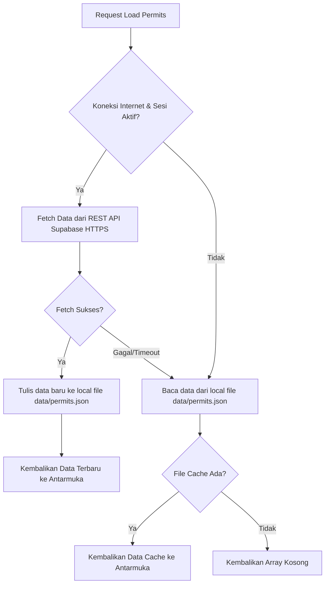

# DRAF TEKNIS RANCANGAN AKTUALISASI LATSAR CPNS 2026
**Umpan Balik Teknis Mendalam Komponen Aplikasi PUTA-Monitor**
**Kantor Otoritas Bandar Udara Kelas II Wilayah VI Padang**

---

## 1. MODUL PEMETAAN SPASIAL (LEAFLET.JS) & VISUALISASI GEOFENCE KKOP

Modul ini bertanggung jawab untuk memetakan secara visual batas-batas ruang udara aman di bandar udara yurisdiksi OBU Wilayah VI serta memplot area izin penerbangan drone (PUTA) yang disetujui.

### A. Alur Kerja Spasial
1. **Inisialisasi Peta & Layer KKOP:**
   Saat aplikasi dimuat, peta interaktif diinisialisasi menggunakan pustaka **Leaflet.js**. Data bandar udara dalam yurisdiksi OBU Wilayah VI (seperti Bandara Internasional Minangkabau - PDG, Bandara Rokot Sipora - RKI, Bandara Depati Parbo Kerinci - KRC) dibaca dari konstanta `REGION_AIRPORTS`.
   Untuk setiap bandar udara, dibuat lingkaran pelindung lateral radius **5.000 meter (5 km)** sebagai perbatasan **Kawasan Keselamatan Operasi Penerbangan (KKOP)** sesuai amanat PM 37 Tahun 2020:
   ```javascript
   // Plot KKOP 5km Ring (No-Fly Zone buffer)
   const nfzRing = L.circle([airport.lat, airport.lng], {
     color: '#4f46e5',     // Indigo-600 border
     fillColor: '#4f46e5',
     fillOpacity: 0.08,
     weight: 1.5,
     dashArray: '4, 4',    // Garis putus-putus
     radius: 5000          // Radius 5 km lateral KKOP
   }).addTo(map);
   ```
   Sebuah *custom HTML marker* berkode IATA (misalnya "PDG") juga diletakkan di koordinat bandara untuk memberikan penanda interaktif bagi inspektur pengawas.

2. **Penarikan & Plotting Koordinat Izin PUTA:**
   Metadata perizinan ditarik secara asinkron dari database cloud Supabase/cache lokal. Struktur data koordinat di dalam JSON perizinan berupa *array of coordinate pairs* (Lintang, Bujur).
   Setiap izin aktif dipetakan ke dalam bentuk poligon geofence:
   ```javascript
   mapShape = L.polygon(permit.coordinates, {
     color: color,          // Hijau untuk izin aktif, kuning pending, abu-abu expired
     fillColor: color,
     fillOpacity: 0.2,
     weight: 1.5
   }).addTo(map);
   ```
   *   **Penanganan Kasus Tanpa Koordinat (Fallback):** Jika berkas izin yang diunggah hanya memiliki data lokasi tekstual tanpa koordinat spasial yang terdefinisi secara presisi, aplikasi menggunakan pencarian fallback untuk mendapatkan titik pusat koordinat daerah tersebut (`getCoordsFromLocation`) dan menggambar wilayah buffer lingkaran default dengan radius **6.000 meter (6 km)** sebagai area izin perkiraan:
       ```javascript
       mapShape = L.circle(fallbackCoords, {
         color: color,
         fillOpacity: 0.15,
         radius: 6000 // Buffer spasial 6 km
       });
       ```

---

## 2. MODUL PARSER TELEMETRI (PYTHON PYULOG) & AUDIT KEPATUHAN RIIL

Modul ini memproses berkas log penerbangan riil drone yang diambil dari autopilot PX4 (`.ulg`) pasca-penerbangan untuk dibandingkan dengan izin operasional tertulis.

### A. Alur Eksekusi Konversi Data
1. **Pemanggilan IPC Bridge (Electron ke Python):**
   Ketika inspektur mengunggah file `.ulg`, antarmuka renderer memanggil `window.api.convertUlg()`. Preload script mengirimkan IPC invoke ke proses utama Electron (`main.js`).
2. **Eksekusi Python Asynchronous:**
   Proses utama menggunakan modul `child_process.execFile` untuk memicu mesin parser Python secara aman tanpa memblokir proses GUI desktop:
   ```javascript
   const { execFile } = require('child_process');
   const pythonScript = path.join(__dirname, 'ulg_converter.py');
   const args = [pythonScript, filePath, outputDir, formats.join(',')];
   
   execFile('python', args, { timeout: 120000 }, (error, stdout, stderr) => { ... });
   ```
3. **Ekstraksi Biner ULog (`ulg_converter.py`):**
   Skrip Python menggunakan pustaka `pyulog` atau parsing biner manual berbasis `struct` untuk membaca struktur log PX4. Topik GPS seperti `vehicle_global_position`, `vehicle_gps_position`, atau `sensor_gps` diekstraksi untuk mengambil data lintang, bujur, waktu (milidetik), kecepatan, dan ketinggian (AGL & AMSL).
4. **Ekspor Format Spasial:**
   Hasil ekstraksi ditulis menjadi file **CSV** (berisi tabel detail parameter per waktu), **KML** (untuk visualisasi 3D lintasan di Google Earth), dan **GPX** (untuk data track GPS standar). Output ini dikembalikan ke Electron dalam format JSON.

### B. Algoritma Audit Kepatuhan (`runComplianceChecks`)
Setelah track spasial diperoleh, fungsi `runComplianceChecks()` di `renderer.js` mengevaluasi 5 parameter utama terhadap area izin:
1.  **Kepatuhan Ketinggian (Altitude Compliance):**
    Membandingkan ketinggian maksimum drone dari log terhadap batas izin (standar 400 kaki/120 meter AGL):
    $$\text{Status Alt} = (\text{Altitude Max Flight} \le \text{Batas Izin})$$
2.  **Kepatuhan Kecepatan (Speed Compliance):**
    Memastikan kecepatan terbang drone tidak melebihi regulasi batas kecepatan udara sipil sebesar **87 knots** (sekitar 161 km/jam).
3.  **Kepatuhan Geofence Area (Geofence Compliance):**
    Melakukan pengecekan geografis (menggunakan algoritma *Ray-Casting Point-in-Polygon*):
    ```javascript
    for (const pt of points) {
      const isInside = isPointInPolygon([pt[0], pt[1]], permitPolygon);
      if (!isInside) geofenceBreached = true;
    }
    ```
4.  **Audit Batas Proximity KKOP (KKOP Proximity Audit):**
    Mengecek apakah koordinat lintasan terbang drone berada dalam jarak **5 km** dari bandar udara di bawah yurisdiksi OBU VI. Jika drone masuk dalam radius 5 km bandara, sistem memverifikasi apakah area masuk tersebut dicakup oleh izin operasional. Jika tidak dicakup, sistem menyalakan alarm peringatan bahaya (*airspace breach*):
    ```javascript
    const insideKkop = isPointInCircle([lat, lng], [airport.lat, airport.lng], 5000);
    if (insideKkop && !insidePermit) kkopBreached = true;
    ```
5.  **Kepatuhan Waktu & Cahaya (Daylight & Time Compliance):**
    *   **Daylight Check:** Memastikan penerbangan dilakukan pada siang hari (antara pukul 06:00 - 18:00 waktu lokal) guna kepatuhan visual drone (*Visual Line of Sight* - VLOS).
    *   **Permit Window Check:** Memvalidasi bahwa UTC timestamp dari log yang dikonversi ke waktu lokal berada di antara jendela jam operasional izin (misalnya 07:00 WIB - 17:30 WIB).

---

## 3. SINKRONISASI DATABASE & MEKANISME OFFLINE-FIRST (SUPABASE POSTGRESQL)

Mengingat wilayah kerja OBU Wilayah VI mencakup daerah terpencil (seperti Mentawai atau perbatasan hutan Sumatera Barat) yang sering mengalami kendala sinyal internet, aplikasi ini menggunakan arsitektur penyimpanan hibrida.

### A. Pengamanan Data Menggunakan Row Level Security (RLS)
Supabase (PostgreSQL) dikonfigurasi untuk mencegah akses data ilegal melalui kebijakan keamanan RLS di tingkat basis data:
*   **Tabel `public.profiles`:**
    Setiap pendaftaran pengguna baru di dalam modul otentikasi secara otomatis memicu fungsi pemicu database (`handle_new_user()`) yang menyisipkan data profil ke tabel dengan role default `'regular'`. 
    Perubahan role menjadi `'inspector'` (Inspektur OBU VI) atau `'dev'` (Administrator) memerlukan persetujuan manual pimpinan.
*   **Kebijakan RLS Izin (Permits Policy):**
    ```sql
    -- Izinkan semua pengguna (termasuk offline/guest) untuk membaca data perizinan
    create policy "Allow all users to read permits"
      on public.permits for select using (true);
      
    -- Hanya izinkan akun bertipe inspector/dev yang sudah disetujui (approved = true)
    -- untuk menambah atau memodifikasi data perizinan PUTA
    create policy "Allow approved inspectors to modify permits"
      on public.permits for insert/update
      using (
        exists (
          select 1 from public.profiles
          where profiles.id = auth.uid()
          and profiles.role in ('inspector', 'dev')
          and profiles.approved = true
        )
      );
    ```

### B. Mekanisme Offline-First (Local Cache Sync)
Untuk menjamin aplikasi tetap berjalan saat tidak ada koneksi internet, proses IPC `load-permits` didesain dengan mekanisme fallback cerdas:



1.  **Membaca dari Cloud Database (Online):**
    Jika komputer terhubung ke internet dan sesi pengguna aktif, aplikasi desktop melakukan request HTTPS ke endpoint API Supabase. Data perizinan terbaru ditarik secara real-time. Setelah data berhasil diambil, aplikasi langsung memperbarui berkas cache lokal `data/permits.json` di harddisk komputer.
2.  **Membaca dari Cache Lokal (Offline Fallback):**
    Jika koneksi database gagal, terjadi timeout jaringan, atau komputer sedang berada di lokasi offline, blok tangkapan kesalahan (`catch block`) di `main.js` akan diaktifkan secara otomatis.
    Sistem akan langsung membaca file fisik `data/permits.json` yang tersimpan secara lokal tanpa memunculkan pesan error *crash* pada pengguna:
    ```javascript
    // Fallback ke cache lokal jika fetch Supabase gagal
    try {
      if (fs.existsSync(permitsPath)) {
        const rawData = fs.readFileSync(permitsPath, 'utf8');
        return JSON.parse(rawData); // Mengembalikan cache perizinan lokal
      }
      return [];
    } catch (error) {
      return [];
    }
    ```
    Melalui mekanisme ini, inspektur tetap dapat mencari data izin, memvisualisasikan geofence yang sudah terdaftar, dan menjalankan modul parser telemetri `.ulg` secara normal di lapangan walaupun tanpa akses internet sama sekali.
